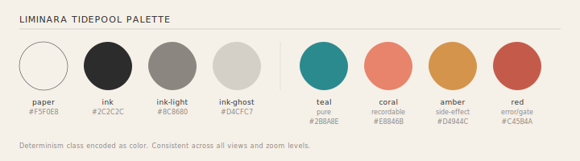
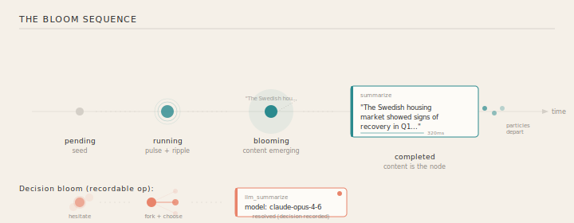
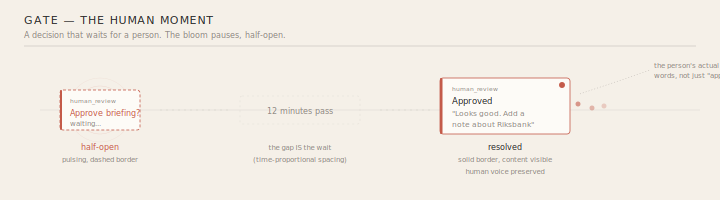
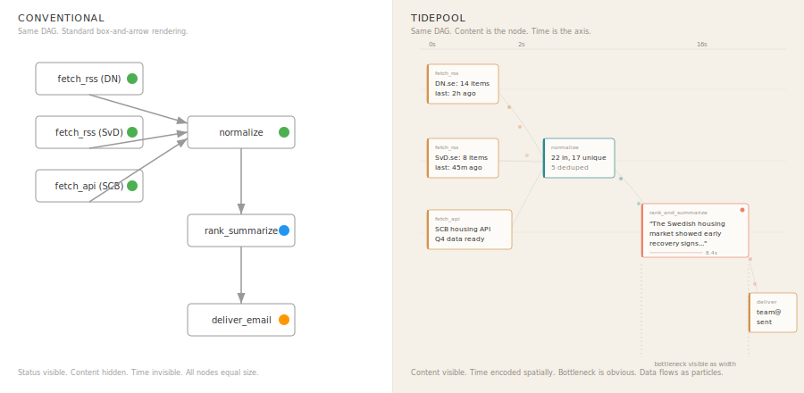
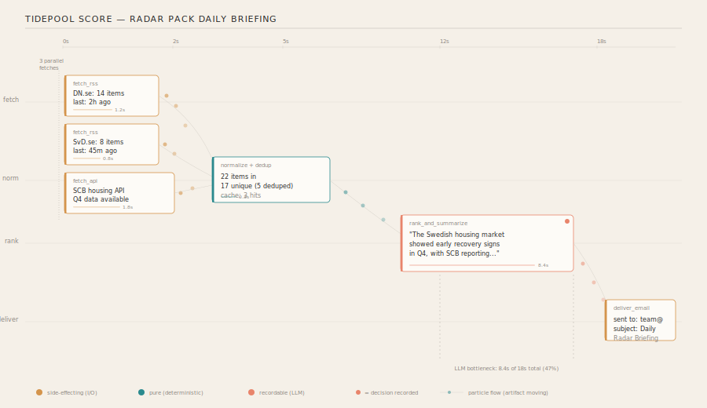
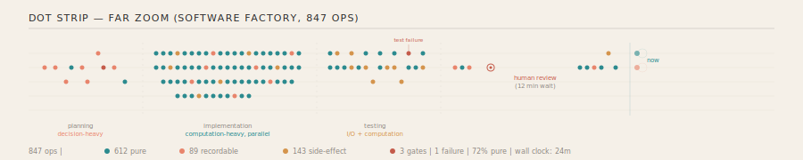

# Visualization Visions for Liminara

Four creative explorations of how Liminara runs could look and feel. Each is a complete vision with static SVGs and animated HTML prototypes. They capture design directions, not specifications.

For the technical spec, see `06_VISUALIZATION_DESIGN.md`.
For design principles, see `04_OBSERVATION_DESIGN_NOTES.md`.

## The four visions

| Vision | Metaphor | Assets |
|--------|----------|--------|
| **A. Tidepool** | A tidepool where nodes bloom like anemones, artifacts flow as particles | This document + `viz/tidepool/` |
| **B. The Score** | An orchestral score — staves, notes, rests, dynamics, slurs | [`viz/score/VISION_SCORE.md`](viz/score/VISION_SCORE.md) |
| **C. The Terrain** | A landscape that rises — hills, contour maps, water in valleys | [`viz/terrain/VISION_TERRAIN.md`](viz/terrain/VISION_TERRAIN.md) |
| **D. The Circuit + Marginalia** | A PCB with manuscript margins — board holds structure, margins hold content | [`viz/circuit/VISION_CIRCUIT.md`](viz/circuit/VISION_CIRCUIT.md) |

All four share the same palette, typography, and design principles. They differ in spatial metaphor and what they privilege.

---

# Vision A: The Tidepool
For design principles, see `04_OBSERVATION_DESIGN_NOTES.md`.

---

## The question

The question isn't "how do we draw a DAG." It's: **how do we show something being made?**

A Liminara run is a story of raw materials (input artifacts) being transformed through a series of steps into finished products (output artifacts). Along the way, choices are made — some by machines, some by humans. The story can be told again, and if you inject the same choices, you get the same result.

The visualization should show this — not a workflow engine advancing through steps, but **things coming into existence**.

---

## How nature solves this

Nature doesn't draw boxes and arrows. Nature grows, flows, branches, accumulates, crystallizes.

**River watersheds** — the most natural DAG. Rain falls on high ground. Water finds its way downhill through tributaries. Tributaries merge into streams, streams into rivers. Everyone understands "downstream." The width of the river encodes how much has accumulated. Bottlenecks are narrows.

**Leaf veins** — a hierarchical network optimized over 400 million years for efficient distribution. Branches (fan-out from the midrib) AND reconnects (anastomosis — veins rejoining). The leaf's shape IS the network's shape.

**Crystals** — growth outward from a seed. Each new face determined by what's already there. The crystal IS its history. A Liminara run crystallizes: the first op is the seed, each subsequent op adds a face.

**Slime mold (Physarum polycephalum)** — finds optimal networks biologically. Placed at Tokyo station locations, it grew a network nearly identical to the rail system. Thick channels for heavy flow, thin for light. Pulsing with life.

---

## What must be perceivable

Most DAG tools privilege **dependency** and **state**. They sacrifice everything else. But consider what a human actually needs:

1. **Content** — what are the results? *(should be dominant)*
2. **Time** — when did things happen, how long did they take?
3. **Decisions** — where did a human or LLM choose? *(the interesting moments)*
4. **Flow** — where is data moving?
5. **Shape** — pipeline? tree? web? *(the shape tells the story)*
6. **State** — done, running, waiting *(least important — encoded in color, not foregrounded)*

Conventional DAG tools go: 6, 4, 5. We invert: **1, 2, 3** as primary.

---

## The Tidepool Score

**Metaphor:** A tidepool — a contained world with life flowing through it. Warm rock, clear water, visible creatures. Combined with the temporal structure of a musical score.

### Spatial model

Time flows left to right. X position IS wall-clock time (proportional). Y position encodes parallel execution lanes — like staves in an orchestral score, each "instrument" gets a line.

This means: **no graph layout algorithm needed.** The layout IS the execution schedule. Every run produces a unique layout automatically — the timing IS the positions. Same run, same layout. Different run, different layout. Reproducibility baked into the visualization.

### The palette

 *(shared across all visions)*

Warm paper background. Ink hierarchy for structure. Four semantic colors mapping to the four determinism classes — consistent across all views and zoom levels.

### The bloom

The signature interaction. A node doesn't "turn green when done." It **blooms** — expanding from a seed dot into a content card, revealing the artifact inside.

**Pending:** A small ghost dot. A seed, barely there.

**Running:** The dot pulses gently. Ripples radiate outward — alive, working. Not a spinner. Breathing.

**Blooming:** The dot expands outward, like an anemone opening. Content fades in — text materializing, data appearing. The computation's result IS the visual presence.

**Completed:** A content card. The op name is small, secondary. The artifact preview is dominant. A timing bar along the bottom shows duration. A colored left edge shows the determinism class.

**Decision bloom:** For nondeterministic choices (LLM calls), the bloom hesitates. Ghost alternatives flicker — faint paths that could have been taken. Then one solidifies. The others fade. The decision is recorded; the coral dot in the corner signals "a choice was made here."

### The gate — the human moment

Gates are where Liminara is most distinctive. A human is in the loop. The visualization should honor this.

The bloom opens partway — showing the prompt, a question hanging in the tidepool. The border is dashed (incomplete). It waits, pulsing gently. Time passes — and the gap in the timeline IS the wait (time-proportional spacing makes long waits visible as wide gaps).

When the human responds, the bloom completes. The card shows the person's actual words — not just "approved" but their voice, their reasoning, preserved.

### Edges as currents

Not lines. Not arrows. **Particle flow.**

Thin, barely-visible structural threads show the dependency skeleton (always present, very faint). When an artifact flows from op A to op B, small colored dots drift along the thread — teal particles for pure computation, coral for LLM outputs, amber for external data.

Particles accumulate at a destination node before it starts — inputs gathering. When all inputs arrive, the bloom begins.

### Concurrency

Visible as **vertical alignment** — multiple blooms happening at the same X position. Parallel fetches, parallel computations. The width of the "busy band" shows how much parallelism the run achieved.

### Bottlenecks

Visible as **wide horizontal gaps** — time passing with one node dominating the timeline. In the comparison below, the 8.4-second LLM call is immediately obvious as the widest card:

The conventional rendering makes all nodes the same size — hiding the fact that one operation consumed 47% of total time. The tidepool makes it impossible to miss.

### The full picture

A complete Radar daily briefing run:

Three parallel fetches (amber, side-effecting) → normalize + dedup (teal, pure) → rank and summarize (coral, recordable — the LLM bottleneck) → deliver (amber). Particles flow between stages. The LLM call dominates the timeline visually. Every result is readable directly from the cards.

---

## At scale

### Far zoom: the dot strip

For large DAGs (100+ nodes), the bloomed cards collapse back to dots. The result is a **dot strip** — a horizontal band of colored dots on parallel lines. Like a DNA sequence, a textile pattern, a geological core sample.

The dot strip for an 847-node Software Factory run tells the story at a glance:
- **Planning phase** — sparse, coral-heavy (lots of LLM decisions)
- **Implementation** — dense, teal-heavy, many parallel lanes (computation burst)
- **Testing** — mixed teal and amber (computation + I/O), with a red dot (test failure)
- **Review** — a gate (the open circle), then a wide gap (12-minute human wait)

The color distribution alone tells you what kind of run this was. 72% pure (teal), 17% I/O (amber), 10% decisions (coral), with one failure and three human gates.

### Semantic zoom

Three detail levels, animated transitions between them:

| Level | Nodes | Labels | Content |
|-------|-------|--------|---------|
| **Far** (dot strip) | Dots (3-4px) | None | None |
| **Medium** (navigate) | Dots (8-12px) | On hover | None |
| **Close** (read) | Bloomed cards | Always | Artifact previews |

### Progressive expansion

For very large DAGs: don't render everything. Start at an entry point, expand neighbors on click. The visible subgraph grows interactively. A minimap shows position within the full dot strip.

### Happy-path slider

Borrowed from process mining (Celonis/Disco): a slider that controls "show the top N% of paths by execution time." At 100%: everything. At 20%: only the critical path. Paths fade in/out smoothly.

---

## Dynamic DAGs (discovery mode)

When the DAG grows during execution (Software Factory, dynamic plan expansion):

**New nodes appear as dots at the right edge** — the "now" point. They fade in from ghost to full color. Existing layout doesn't change — because past time positions are fixed. The layout only grows rightward.

Mental map preservation is automatic. You never lose your place.

New lanes can appear if needed — a new instrument joining the score mid-piece. The Y-axis expands gently downward to accommodate.

---

## The key insight

In every existing DAG tool, the primary event is a **status change** — a box turns from gray to green. The result is hidden behind a click.

In the Tidepool, the primary event is **content appearing**. A result materializing. A text emerging. A decision crystallizing.

The visualization is not about *process completing*. It's about *things coming into existence*.

That's the philosophical alignment with Liminara. The runtime captures the moment where possibilities collapse into actuality — the nondeterministic choice that could have gone many ways, but went this way. The bloom IS that moment, made visible.

---

## Interactive prototype

An animated HTML prototype demonstrating the bloom, particle flow, and temporal unfolding is available at:

[`viz/tidepool/tidepool-prototype.html`](viz/tidepool/tidepool-prototype.html)

Open in a browser. Click "Run" to watch the Radar pipeline bloom.

---

## References

- **Giorgia Lupi** — Dear Data, Data Humanism. Cream paper, small marks, annotation-first.
- **TouchDesigner** — each node is a live viewport of its output.
- **Disco (Fluxicon)** — animated dots flowing through process graphs.
- **RxMarbles** — temporal-first, values flowing through operators.
- **Bret Victor** — making computation visible and tangible.
- **Physarum polycephalum** — biological optimal network finding.

### Natural DAG metaphors considered
- River watershed (fan-in, flow, accumulation)
- Leaf veins (hierarchical branching with anastomosis)
- Crystal growth (event sourcing = geological strata)
- Musical score (parallel temporal structure, refined over centuries)
