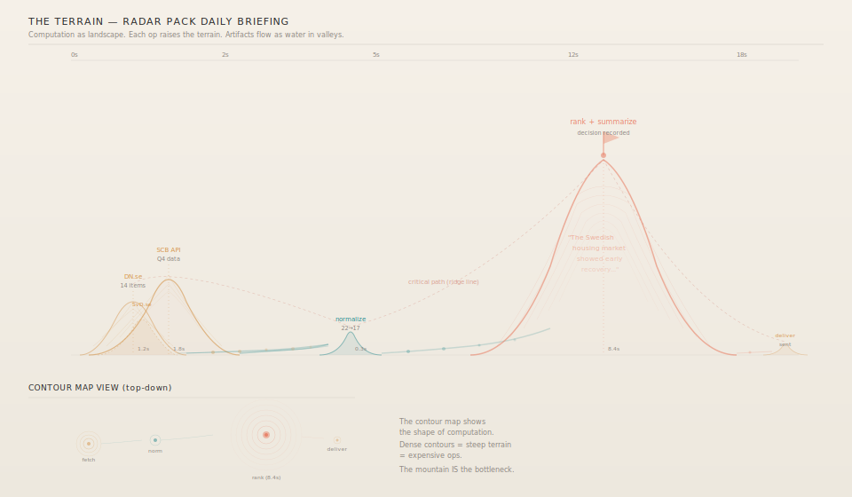
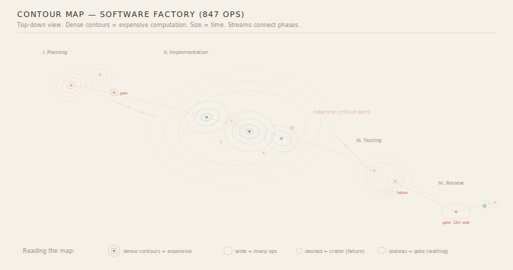

# Vision C: The Terrain

Computation as landscape. Each operation raises the terrain. The height of a hill IS the cost of the computation that built it. Artifacts flow as water in the valleys between.

---

## The metaphor

A geological landscape forms over time. Rain falls, water carves channels, sediment deposits, mountains rise. The shape of a canyon IS the record of the water that carved it. The strata in a cliff face ARE the history of the region.

A Liminara run forms the same way:
- **Each completed op** deposits material — raising the terrain at its location
- **Hill height** = op duration (or cost, or importance)
- **Artifacts** flow downhill as water — from completed ops to waiting ones
- **The critical path** is the ridge line — the highest continuous path through the terrain
- **Decisions** are flags planted at peaks
- **Gates** are flat plateaus — ground that refuses to rise until a human acts
- **Failures** are craters — collapsed terrain

---

## The isometric view

A Radar daily briefing as landscape:

Three amber foothills (parallel fetches) flow into a small teal ridge (normalize), which feeds a massive coral **mountain** (the LLM rank+summarize — 8.4 seconds, towering over everything). A tiny amber bump at the end (deliver).

**Contour lines** trace the elevation — dense contours mean steep terrain (expensive computation). The LLM mountain has six contour rings. The normalize ridge barely has one.

**Water particles** flow in the valleys between hills, carrying artifacts downstream. The streams merge at the normalize ridge (fan-in) and a single wide stream feeds the mountain.

The **critical path** traces the ridge line — a dashed red line connecting the peaks. It's the spine of the computation.

---

## The contour map (top-down)

For large DAGs, the isometric view gets cluttered. The contour map is the far-zoom alternative — a topographic map viewed from above:

An 847-node Software Factory run as a contour map:

- **Planning** — a coral hill cluster (LLM decisions) in the northwest, with a gate marked as a col (saddle point)
- **Implementation** — a massive teal mountain range occupying the center, with multiple peaks (file generation, compilation, refactoring), amber foothills (I/O), and scattered coral peaks (LLM calls)
- **Testing** — a medium mixed-color range in the southeast, with a **failure crater** (dashed red contours, inverted — the ground collapsed)
- **Review** — a flat plateau (the gate, 12 minutes of waiting) and small final peaks

Dense contours = expensive ops. Wide ranges = many parallel ops. The map's shape tells you what the run was: computation-heavy center, decision-heavy planning, a crater where something failed.

---

## Natural vocabulary

The terrain metaphor gives a rich vocabulary that maps to computation concepts:

| Terrain | Computation |
|---------|-------------|
| Hill / peak | Completed operation (height = duration) |
| Mountain range | Phase of related operations |
| Valley / stream | Artifact flow path |
| Ridge line | Critical path |
| Contour density | Computational expense |
| Plateau | Gate (flat, waiting for human) |
| Crater | Failure (collapsed terrain) |
| Col / saddle | Decision point between paths |
| Watershed | Fan-in (multiple sources converging) |
| Delta | Fan-out (one source splitting) |
| Foothills | Small/fast supporting ops |
| Strata | Event history (visible in cross-section) |
| Erosion channel | Replay path (water re-carving the same canyon) |

---

## Replay as erosion

When replaying a run, water re-carves the same channels. The terrain rises again in the same pattern (same decisions → same results). But if the replay diverges — different decisions — the water cuts a **new channel**. The divergence is visible as a fork in the canyon.

`diff(simulation.terrain, live.terrain)` shows exactly where reality carved a different path than the plan predicted.

---

## Strengths and limitations

**Strengths:**
- Bottlenecks are *physically imposing* — you can't miss a mountain
- Scales beautifully — a mountain range with 1000 peaks is still readable as a landscape
- The contour map is information-dense and beautiful
- Failure (craters) and success (peaks) have visceral visual impact
- The geological/temporal metaphor aligns deeply with event sourcing
- Unique — no one else visualizes computation as terrain

**Limitations:**
- Harder to read precise values (you need to count contours or read labels)
- The isometric view can get cluttered with overlapping hills
- Fan-in/fan-out is less explicit than graph edges
- Artifact content (text previews) is harder to embed naturally than in cards or lyrics
- Implementation complexity — 3D-style rendering or sophisticated 2D contour generation
- May feel abstract to users who expect a process diagram

---

## The cross-section view (not shown)

A possible secondary view: slice the terrain along the time axis to get a **profile** — a side elevation showing how computation effort rises and falls over time. Like a geological cross-section. The area under the curve = total computation. Spikes are bottlenecks. Valleys are idle periods. This would be simpler to implement than the full terrain and could serve as a compact overview.

---

## Interactive prototype

[`terrain-prototype.html`](terrain-prototype.html) — open in a browser. Click "Grow" to watch the landscape rise. Hills emerge as ops complete. Water flows between them. The critical ridge line appears at the end.
