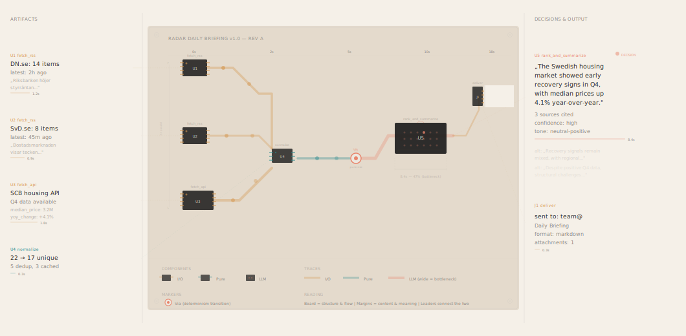
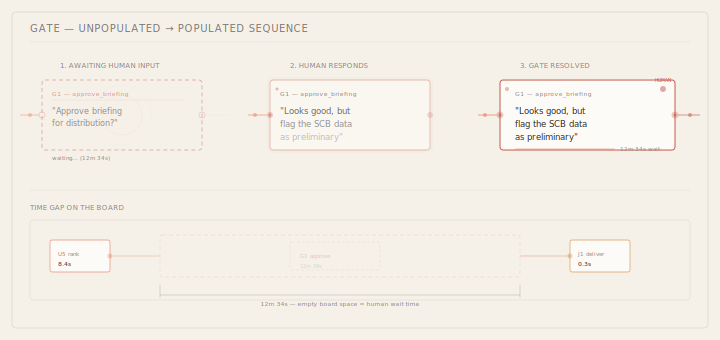
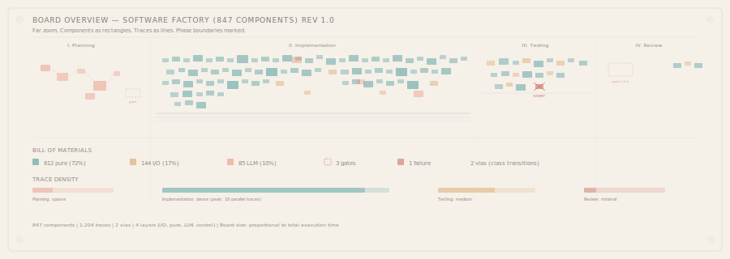

# Vision D: The Circuit + Marginalia

Computation as electronics. The board holds the structure — small, precise IC packages, bold 45-degree traces, vias at decision points. The margins hold the meaning — artifact content, LLM outputs, human words. The board is the score; the margins are the commentary.

---

## The two layers

This vision separates **structure** from **content** — inspired equally by PCB engineering drawings and medieval illuminated manuscripts.

**The Board** (center): A faithful PCB layout. Components are small dark IC packages with colored pins. Traces are thick, colored, 45-degree routed copper. Vias mark where signals cross between determinism layers. Silk screen labels provide designators (U1, U2, J1) and minimal annotations. **No content here.** The board shows topology, timing, and flow.

**The Margins** (left and right): Artifact content lives here — the actual text, data, decisions, human words. Each margin entry connects to its component via a thin dashed leader line. The left margin holds inputs and intermediate results. The right margin holds outputs and decisions. Like marginalia in a manuscript — the glosses that explain and enrich the text.

This separation solves a fundamental problem: **content and structure compete for space.** Every DAG tool that puts content inside nodes either makes nodes too large (destroying the graph's shape) or truncates content (destroying readability). The margin approach gives both unlimited room.

---

## The metaphor

A Liminara run maps to a PCB:
- **Each op** is an IC package — SOIC-8 for I/O, QFP for pure computation, BGA for LLM calls
- **Component size** ∝ op duration — a 0.3s normalize is a tiny chip; an 8.4s LLM call is a large BGA
- **Traces** connect outputs to inputs — colored by determinism class, width ∝ data volume
- **Vias** mark determinism boundary crossings (pure → recordable = a layer change)
- **Silk screen** provides designators and minimal labels on the board itself
- **Margins** hold all human-readable content, connected by leader lines
- **Board revision** increments with each run

---

## The full board with marginalia

The center board shows the Radar pipeline as actual electronics: three SOIC-8 I/O chips (U1–U3) with amber pins, traces jogging at 45° to converge on a tiny teal chip (U4, normalize). A via marks the transition to the recordable layer. A large BGA package (U5, rank_and_summarize) with its ball grid visible dominates the right side. An edge connector (J1) delivers output.

The **left margin** holds the input artifacts — each fetch's results with actual Swedish headlines, data points, timing bars. Leader lines connect each gloss to its chip.

The **right margin** holds the LLM decision — the full summary text, confidence assessment, ghost alternatives (faded, paths not taken), and the delivery confirmation. The decision marker highlights which BGA ball was "chosen."

The board is clean and geometric. The margins are rich and readable. The leader lines bridge the two worlds.

---

## The component bloom

Like the Tidepool's bloom, but in hardware terms:

**Pending:** An empty footprint — solder paste on pads, component not yet placed. Silk screen outline shows the expected package. The corresponding margin entry is a ghost (faded placeholder showing what will appear).

**Running:** Reflow — a faint glow around the pads. Signal particles approach from input traces. The margin entry begins to materialize (text fading in from transparent).

**Completed:** The IC is placed — dark package, visible pins, designator readable. The margin entry is fully opaque. The leader line solidifies.

**Decision:** The BGA's ball grid is visible. One ball is highlighted (the chosen output). Ghost alternatives appear faded in the margin below the chosen text — paths not taken, preserved for audit.

---

## Gates as unpopulated footprints

A gate is where the board is **incomplete**. The footprint is laid out — pads ready, silk screen showing the prompt — but no component is placed. In the margin, the prompt text appears with a dashed border, waiting.

When the human responds, the component drops in. The margin fills with their actual words. The leader line connects. Signals flow onward.

The **time gap** is visible as empty board space between the pre-gate and post-gate components. A dimension line marks the wait: "12m 34s — empty board space = human wait time."

---

## At scale

### The board overview (far zoom)

At far zoom, ICs shrink to colored rectangles, traces become thin lines, and margins collapse. The result looks like a real PCB layout in a CAD tool — dense routing channels, component clusters, phase boundaries.

An 847-node Software Factory as a board:
- **Planning** — sparse coral ICs with an unpopulated gate footprint
- **Implementation** — dense teal component farm, thick bus traces, amber I/O peripherals
- **Testing** — mixed components with a **short circuit** marker (red X — failure)
- **Review** — unpopulated footprint (12-minute gate), then delivery connectors

### Semantic zoom

| Level | Board | Margins | Leader lines |
|-------|-------|---------|-------------|
| **Far** (board overview) | Colored rectangles, thin traces | Hidden | Hidden |
| **Medium** (navigate) | IC shapes + designators, colored traces | Collapsed (titles only) | On hover |
| **Close** (inspect) | Full IC detail, particle flow, vias | Full content, ghost alternatives | Always visible |

### Progressive marginalia

At medium zoom, margins show only the designator and a one-line summary. At close zoom, they expand to show full content, timing bars, and ghost alternatives. This is exactly how medieval manuscripts work — a quick reader scans the text; a careful reader reads the glosses.

---

## What the PCB + marginalia combination adds

**Content gets unlimited space.** The LLM's full summary, the human's exact words, the data tables — all readable without distorting the graph layout. The board stays clean.

**The board is the map, the margins are the territory.** You can understand the computation's structure from the board alone. You can understand its results from the margins alone. Together, they tell the full story.

**45-degree routing** produces clean, distinctive layouts. The constraint (no arbitrary angles) is what makes it readable.

**Component designators** (U1, U2, J1) are a compact reference system. "Check the margin note for U5" is natural language.

**Trace width as data encoding** — the thick coral trace feeding U5 makes the data bottleneck visible without labels.

**The via as decision marker** — where computation crosses between determinism classes. Exact metaphor.

**Ghost alternatives in the margin** — the paths not taken, visible but faded. This is unique to the marginalia approach — there's room for them.

**Board revisions** — Rev A, Rev B. Each run is a revision. Replays produce the same board.

---

## The manuscript connection

Medieval manuscripts had a clear visual hierarchy:
- **The text** (center column): the authoritative content, carefully laid out
- **Glosses** (margins): commentary, translations, cross-references, corrections
- **Manicules** (☞): pointing hands drawing attention to important passages
- **Historiated initials**: decorated letters embedding illustrations within the text structure

The Circuit borrows this directly:
- **The board** = the text (structure, authority, the canonical layout)
- **Margin entries** = glosses (content, meaning, human voice)
- **Leader lines** = manicules (connecting commentary to source)
- **The via** = historiated initial (a decorated structural element that carries extra meaning)

---

## Hybrid possibilities

- **Circuit + Tidepool bloom**: The component's margin entry blooms — text materializing like the Tidepool's anemone opening
- **Circuit + Score dynamics**: Silk screen annotations use dynamics vocabulary — `fff` near U5, `pp` near U4
- **Circuit + Metro colors**: Trace colors follow metro-line conventions; at far zoom, named routes become readable paths through the board
- **Circuit + Terrain**: Component density renders as a heat map at far zoom — "hot spots" where computation is dense

---

## Strengths and limitations

**Strengths:**
- Content and structure don't compete for space — both get as much room as they need
- The board reads like a real PCB — distinctive, precise, immediately recognizable
- Margins allow full artifact previews, ghost alternatives, and rich annotations
- Scales naturally — large boards with margin indices, like a textbook with footnotes
- Component designators provide compact reference system
- The manuscript/marginalia aesthetic is beautiful and has centuries of refinement
- Via as determinism-transition metaphor is conceptually exact
- Gate as unpopulated footprint is immediately intuitive

**Limitations:**
- Requires more horizontal space than an all-in-one layout (board + two margins)
- Leader lines can tangle at high density — needs careful routing or hover-to-highlight
- The two-layer reading model (board then margin) is slightly less immediate than content-in-node
- May feel unfamiliar to users expecting a single integrated view
- Mobile/narrow viewports need a different layout strategy (margins below, or collapsible)

---

## Interactive prototype

[`circuit-prototype.html`](circuit-prototype.html) — open in a browser. Click "Solder" to watch the Radar pipeline populate. Components drop onto footprints. Traces light up as signals flow.

---

## References

- **Boldport** — PCBs as art objects. Beautiful board layouts designed for aesthetic as well as function.
- **PCBmodE** — Python tool for creating artistic PCB layouts with SVG import.
- **KiCad** — open-source EDA with clean SVG export. Reference for trace routing aesthetics.
- **NeuroLines** — subway-map metaphor for neural pathways, combining metro and circuit aesthetics.
- **OCTI algorithm** — octilinear (45-degree) graph layout, originally for metro maps.
- **Book of Kells / Lindisfarne Gospels** — the pinnacle of marginalia as visual design.
- **Tufte's marginalia** — Edward Tufte's books use side margins extensively for figures and notes.
- **Giorgia Lupi** — annotation-first data visualization, cream paper, hand-drawn quality.
