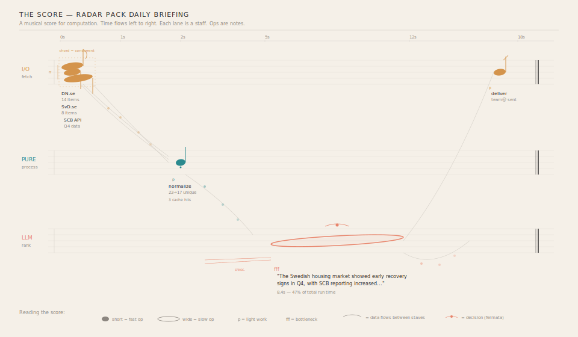
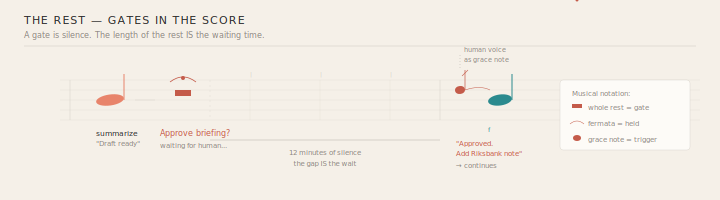
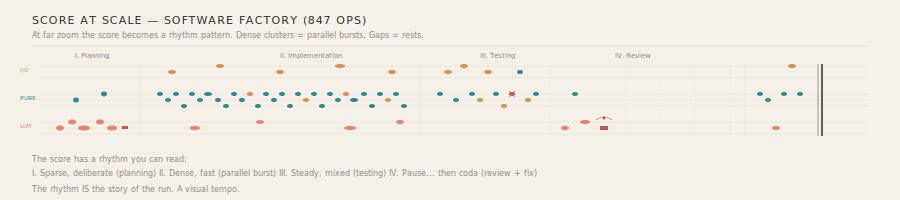

# Vision B: The Score

A musical score for computation. The most refined system humans have invented for encoding parallel, temporal, structured information on a 2D surface — applied to Liminara runs.

---

## The metaphor

An orchestral score encodes:
- **Parallel voices** — each instrument on its own staff line
- **Time** — left to right, proportional
- **Duration** — note width (whole note vs quarter note vs grace note)
- **Dynamics** — loud (important/expensive) vs quiet (light/fast)
- **Silence** — rests are visible, deliberate, meaningful
- **Connection** — slurs and ties link notes across staves

Every one of these maps to a Liminara run.

---

## The mapping

| Music | Liminara |
|-------|----------|
| Staff | Execution lane (grouped by type: I/O, pure, LLM) |
| Note | Operation (positioned at execution time) |
| Note width | Duration (wide = slow, narrow = fast) |
| Chord | Concurrent ops (vertical alignment) |
| Rest | Gate (waiting for human input) |
| Fermata | Decision point (held, nondeterministic) |
| Grace note | Human response that triggers continuation |
| Slur | Data dependency across staves |
| Dynamics (p/f/fff) | Computational weight (light/heavy/bottleneck) |
| Lyrics | Artifact preview (content below the staff) |
| Double bar line | Run completion |
| Crescendo | Building toward an expensive operation |
| Staccato | Fast, cached, or trivial ops |

---

## The full score

A Radar daily briefing rendered as an orchestral score:

Three staves: I/O (amber), Pure (teal), LLM (coral). The three parallel fetches form a **chord** — a burst of concurrent I/O. The normalize op is a **staccato** note — short, sharp, fast. The LLM rank+summarize is a **whole note** — wide, sustained, dominating the score. Its fermata marks the decision. The deliver is a **grace note** — quick, almost ornamental.

The score has **dynamics**: the parallel fetches are forte (busy), the normalize is piano (quiet, fast), the LLM call is fortissimo (the bottleneck, impossible to miss). A crescendo hairpin builds toward it.

**Artifact content appears as lyrics** beneath each note — the actual results, readable in context.

---

## The rest: gates as silence

In music, a rest is not nothing — it's a deliberate silence. The audience holds its breath. A gate in the score is exactly this: a **whole rest with a fermata** (held indefinitely).

The length of the rest IS the waiting time (time-proportional spacing). A 12-minute human review is a long, visible silence in the score — empty measures that make the wait palpable.

When the human responds, their answer appears as a **grace note** — a small, ornamental note that triggers the next phrase. The human's voice enters the score as a performer joining the ensemble.

---

## At scale

At far zoom, the score becomes a **rhythm pattern**. Dense clusters of note-marks = parallel bursts. Gaps = rests. The four movements of a Software Factory run are immediately readable:

1. **Planning** — sparse, coral-heavy (LLM decisions), deliberate tempo
2. **Implementation** — dense, teal-heavy (computation), fast parallel voices, presto
3. **Testing** — steady mixed rhythm, with a red dissonant note (test failure)
4. **Review** — a fermata rest (human gate), then a brief coda

The rhythm IS the story. You can "hear" the run's tempo.

---

## What makes this distinctive

**Duration as a first-class visual encoding.** In standard DAG tools, every node is the same size regardless of how long it took. In the score, a 0.3-second normalize is a staccato dot and an 8.4-second LLM call is a whole note stretching across the page. Duration is not a label — it's the shape of the mark.

**Silence is visible.** Gates and waiting periods are rests — visible absences. You see where the computation paused, for how long, and what broke the silence.

**The ensemble metaphor.** Different types of computation are different instruments. I/O is the percussion section (regular, rhythmic, foundational). Pure computation is the strings (dense, sustained, the body of the work). LLM calls are the brass (loud, expensive, dramatic). Human gates are the conductor's pause.

---

## Strengths and limitations

**Strengths:**
- Handles parallelism naturally (multiple staves, chords)
- Duration encoding is immediate and intuitive
- Rich vocabulary of marks (notes, rests, dynamics, slurs)
- Centuries of refinement in readability
- Scales well — orchestral scores have 20+ staves

**Limitations:**
- Musical notation literacy is not universal
- Complex DAG structures (heavy fan-in/fan-out) are harder to express than in a spatial graph
- Inline content (artifact previews) competes with the notation for space
- The metaphor may feel precious or over-clever to some users

---

## Interactive prototype

[`score-prototype.html`](score-prototype.html) — open in a browser. Click "Play" to watch the Radar pipeline perform.
